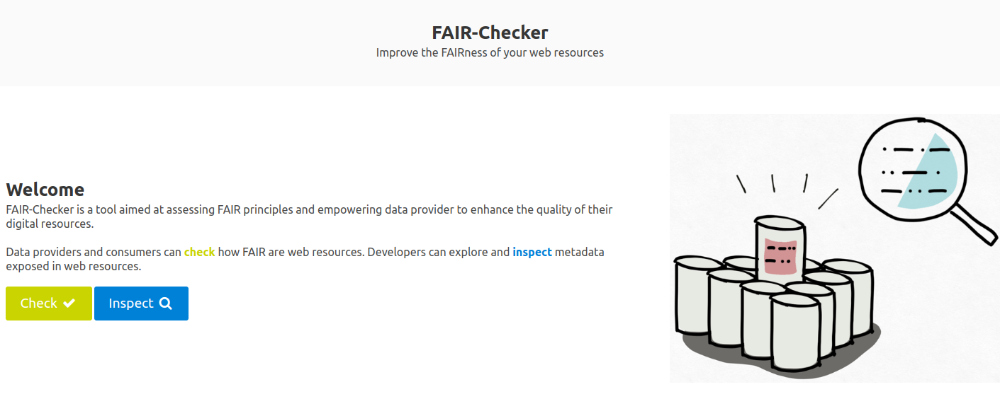
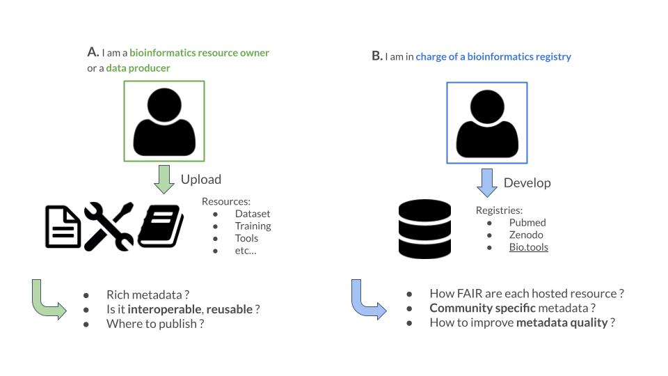
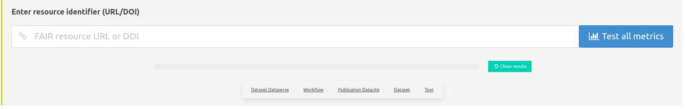
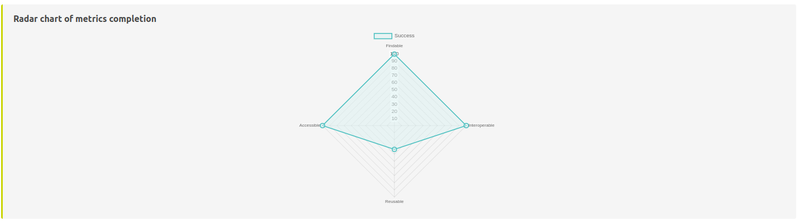
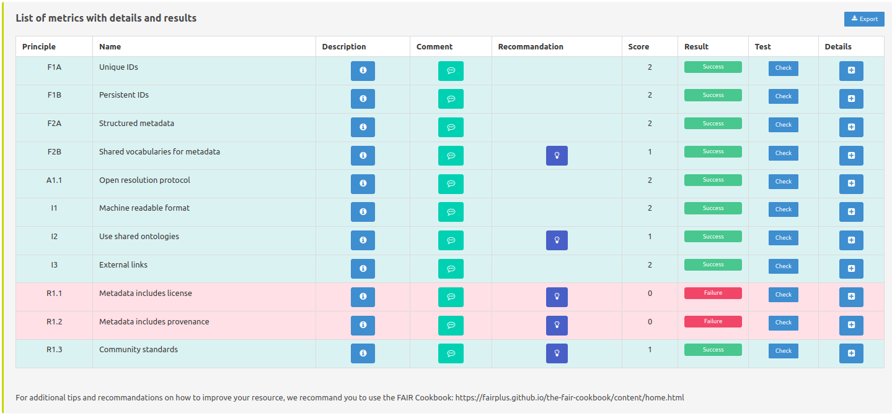
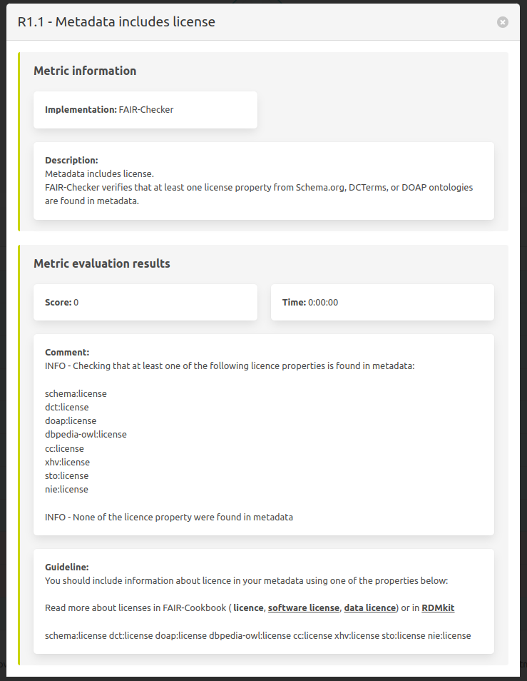
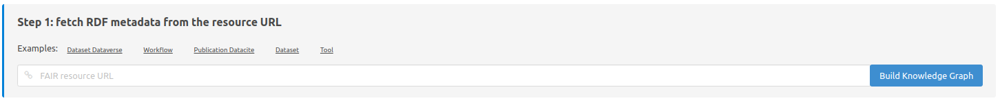
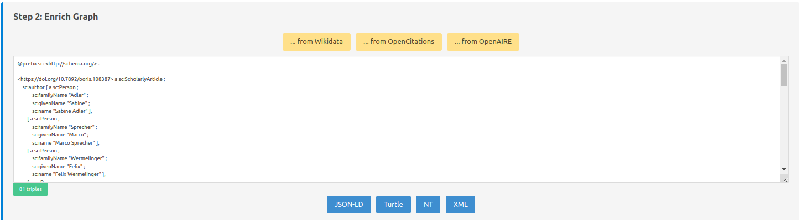
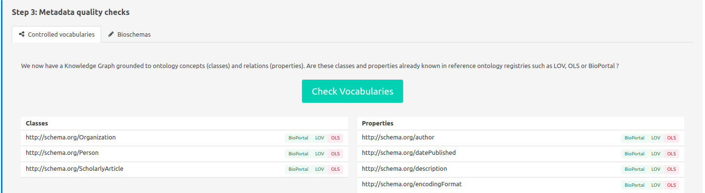
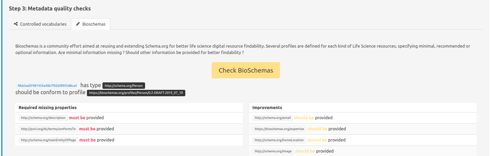

.. FAIR-Checker documentation master file, created by
   sphinx-quickstart on Thu Aug 25 16:45:36 2022.
   You can adapt this file completely to your liking, but it should at least
   contain the root `toctree` directive.

Welcome to FAIR-Checker's documentation!
========================================

This is the user documentation of FAIR-Checker, it aims at guiding the user through the steps of evaluating and improving the FAIRness of life science web resources.

.. toctree::
   :maxdepth: 3
   :caption: Contents:

Landing Page
============

Check
=====

FAIR-Checker is targeting two kind of users:
--------------------------------------------

User A will most likely use page “Check” while user B will most likely use page “Inspect”.

Paste URL or DOI to be tested
-----------------------------

Here it is possible to paste an URL or a DOI to launch the evaluation.

Summary of tests
----------------

This plot shows the normalized evaluations results where each side represents F, A, I, R dimensions.

Individual results for each metrics
-----------------------------------

Here we present each metric and the corresponding evaluation result.

* Principle/Name: name of the metric and the FAIR principle it applies to.
* Description: description of what the metric evaluate and need to be validated.
* Comment: logs of what is actually done to evaluate the resource.
* Recommandation: understandable explanation of what could be done to validate the metric, additionally pointing to external resources such as FAIR-Cookbook and RDMkit
* Details: allow to see full details on one page of one specific metric and the test done

Details of a specific metric test
---------------------------------

On the previous table the last column “Details” leads to this view of one metric. Presenting information in a more complete manner.

Inspect
=======

Step 1:  fetch RDF metadata from the resource URL
-------------------------------------------------

Here it is possible to paste an URL or a DOI to extract the metadata from the web page and form a local RDF graph.

Step 2: Enrich the local knowledge graph
----------------------------------------

This screenshot displays the metadata retrieved through the resource (in RDF format).

Here it is possible to:
Try to request public knowledge graphs (through their SPARQL endpoints) to incorporate linked metadata (yellow buttons):
* Wikidata: …
* Opencitation: …
* OpenAIRE: …
You can also change the format of the displayed RDF graph (blue buttons):
* JSON-LD
* Turtle (TTL)
* N-triples (NT)
* RDF/XML

Step 3: Metadata quality checks - controlled vocabularies
---------------------------------------------------------

Here it is verified if metadata classes and properties are well described in ontology registries, ensuring quality metadata. It is better having every metadata found in at least one of the registries. If not, try to find synonyme terms from another ontology to describe your metadata that is more commonly known and used.

FAIR-Checker queries the following ontology registries:
* LOV:
* BioPortal:
* OLS:
It assesses that the used properties and classes are found in these registries.

Step 3: Metadata quality checks - Bioschemas
--------------------------------------------

Finally, FAIR-checker verifies if the resource metadata (RDF) is compliant with a specific metadata profile, as proposed through the Bioschemas initiative.
e.g.: A property such as documentation will have a different importance depending on the resource type:
it will be more important for a Software than for a Publication	.
Thus, it is good practice to try and follow the specifications of the profile (here) that better suit the evaluated resource and will lead to a more FAIR resource.

