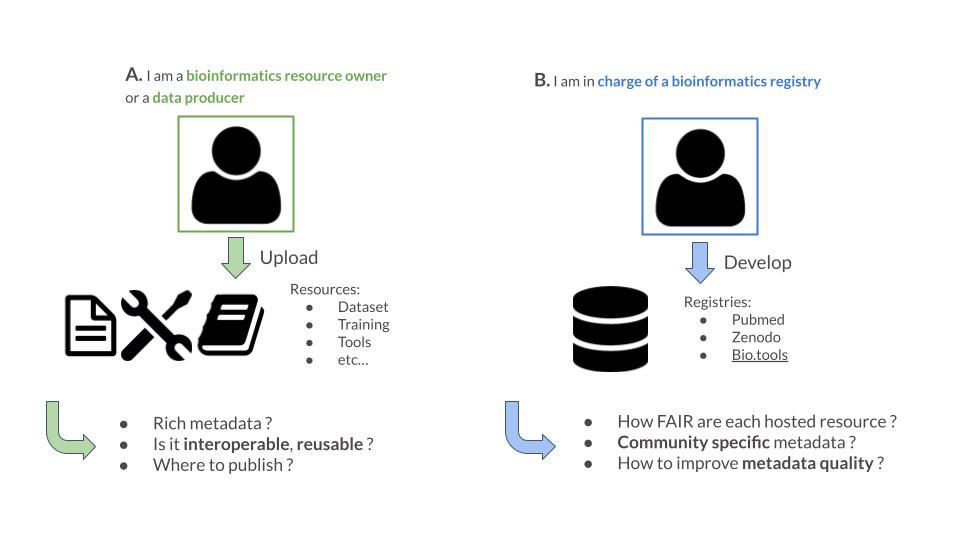
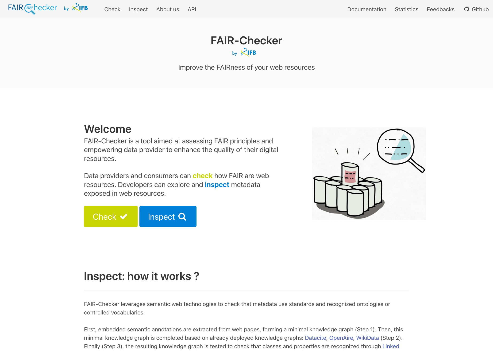
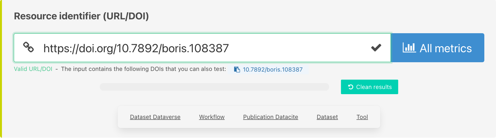
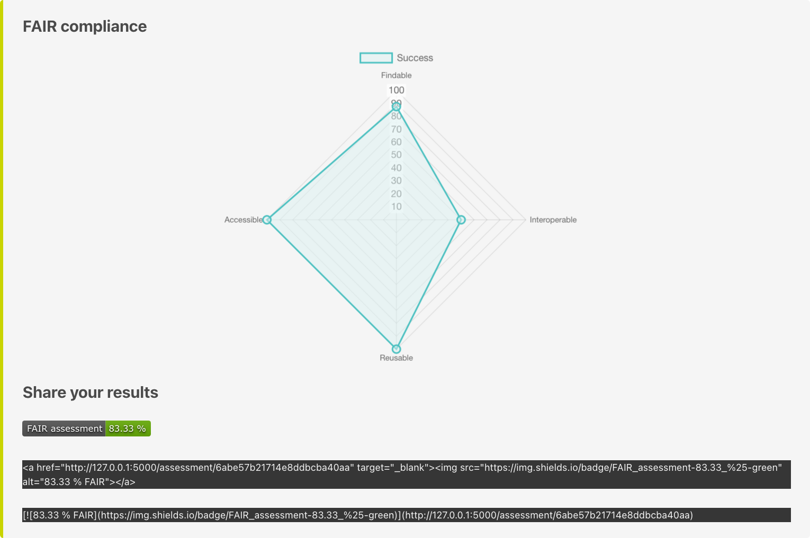
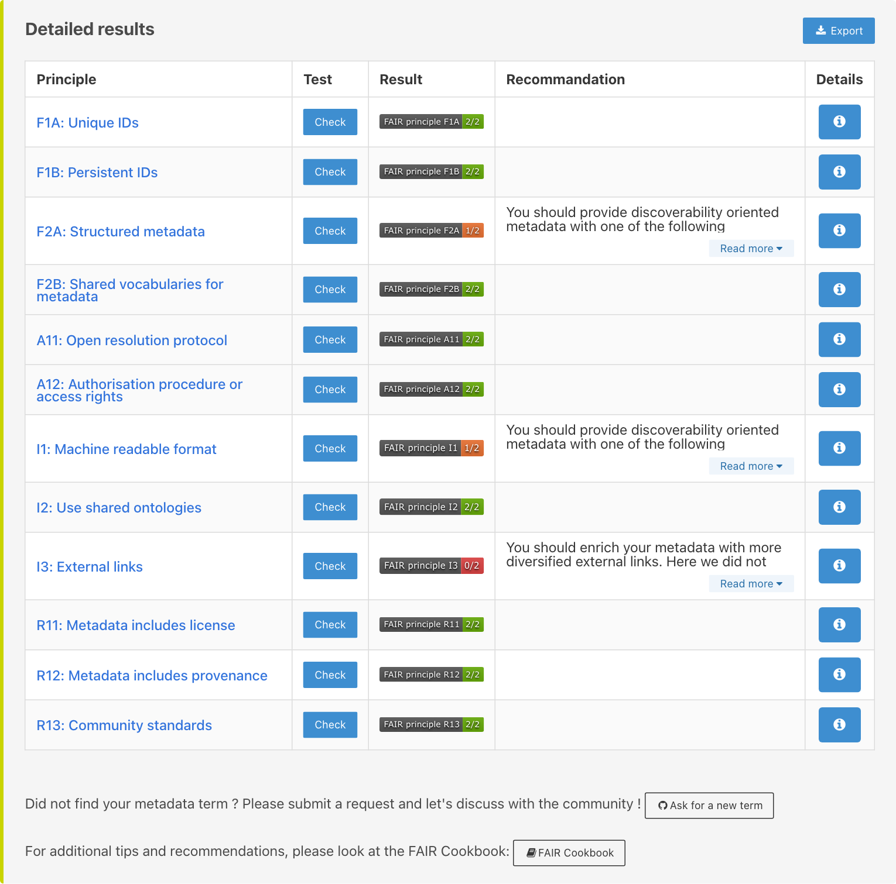
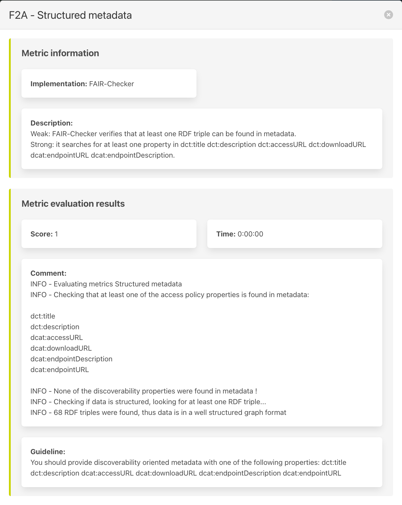
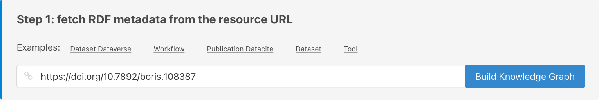
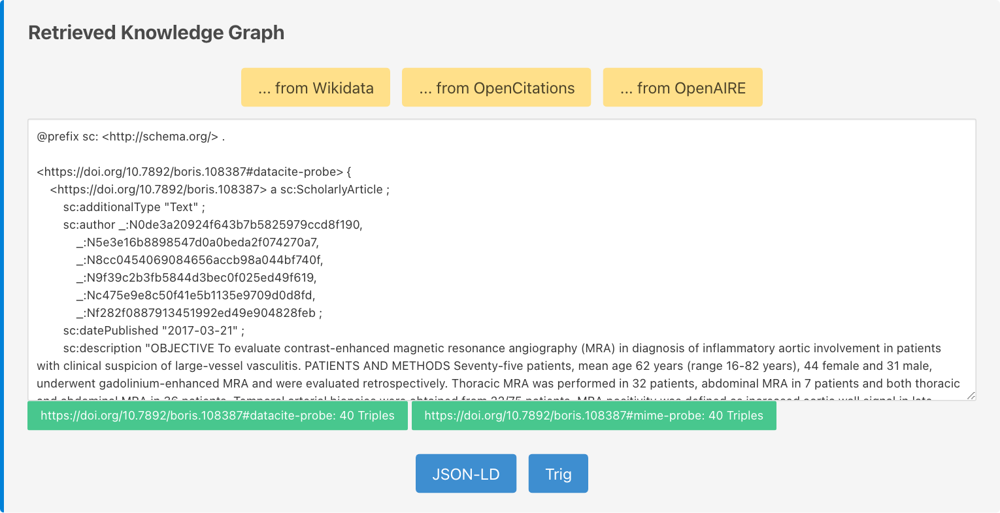
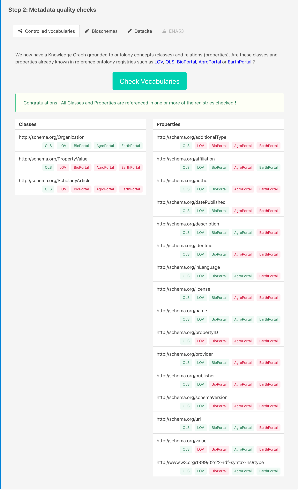
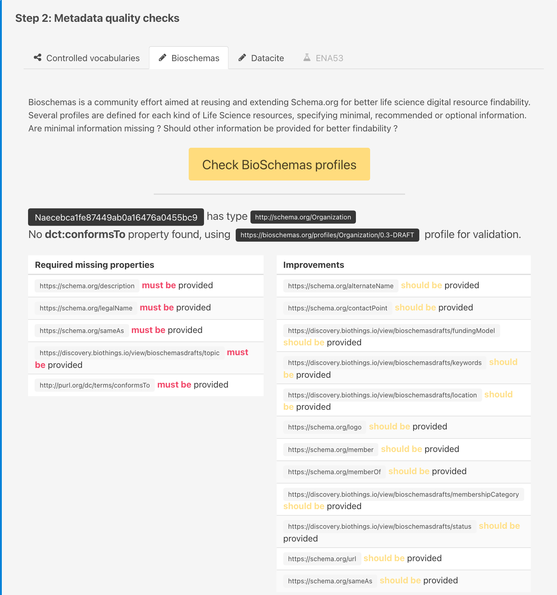

.. FAIR-Checker documentation master file, created by
   sphinx-quickstart on Thu Aug 25 16:45:36 2022.
   You can adapt this file completely to your liking, but it should at least
   contain the root `toctree` directive.

Welcome to FAIR-Checker's documentation!
========================================

`FAIR-Checker <https://fair-checker.france-bioinformatique.fr/>`_ is a web tool to **evaluate and improve the FAIRness**
(Findable, Accessible, Interoperable, Reusable) of life science web resources such as datasets, software, tools,
databases or publications.

Give it the URL or the DOI of a resource. FAIR-Checker retrieves the metadata published with this resource, tests it against a
set of FAIR metrics, and tells you what is already good and what could be improved.

.. toctree::
   :maxdepth: 3
   :caption: Contents:

.. contents:: On this page
   :local:
   :depth: 2

Which page should I use?
========================

FAIR-Checker targets two kinds of users, each with a dedicated page.

.. list-table::
   :header-rows: 1
   :widths: 14 43 43

   * -
     - **Check**
     - **Inspect**
   * - **Intended for**
     - Data scientists, researchers, data managers and data stewards who want to know *how FAIR* a resource is
       and *what to do* to improve it. No prior knowledge of metadata formats or semantic web is needed.
     - Developers, computer scientists and knowledge engineers, experts in ontologies and semantic web
       technologies, who want to *see and debug the metadata* published by a resource.
   * - **You get**
     - A FAIR score, a radar chart, and one plain-language recommendation per metric.
     - The RDF knowledge graph extracted from the resource, linked-data enrichment, and quality checks of its
       vocabularies and metadata profiles.
   * - **Typical question**
     - "Is my dataset FAIR? What should I fix first?"
     - "Which triples does a harvester see on my page? Are my terms defined in public registries? Does my
       markup conform to the Bioschemas profile?"

Landing Page
============

The landing page is the entry point of the application. The side menu gives access to the two evaluation pages:
**How FAIR is my resource?** (the *Check* page) and **How to improve metadata?** (the *Inspect* page), as well as to the
*About & Feedbacks* and *Usage statistics* pages.

   The landing page, with direct access to the Check and Inspect pages.

.. note::

   FAIR-Checker only evaluates what it can retrieve on the Web. The resource must be publicly reachable (no login
   required), and its metadata must be published in the page itself or through standard Web mechanisms.

How FAIR-Checker finds the metadata of a resource
-------------------------------------------------

A web resource is usually published as a page for humans, but the same resource can also be described in a form that
machines understand. FAIR-Checker looks for this machine-readable description in several places, and
**content negotiation** is the first one it tries.

*Content negotiation* is a standard feature of the HTTP protocol: when it requests a URL, a client states in the ``Accept``
header which representation it wants, and the server answers with the best match. A browser asks for
``text/html`` and gets a web page. FAIR-Checker asks for the metadata formats of the semantic web, one after the other:

.. list-table::
   :header-rows: 1
   :widths: 35 65

   * - ``Accept`` header
     - Format
   * - ``application/ld+json``
     - JSON-LD
   * - ``application/rdf+xml``
     - RDF/XML
   * - ``text/turtle``
     - Turtle
   * - ``application/n-triples``, ``text/n3``
     - N-Triples, Notation3
   * - ``application/trig``, ``application/n-quads``
     - TriG, N-Quads (RDF with named graphs)

Each answer that can be read as RDF is added to the metadata collected for the resource. You can try it from a terminal, for
example on a DOI, which is resolved to the description of the resource in JSON-LD (Schema.org vocabulary) instead of its web page:

.. code-block:: bash

   curl -L -H "Accept: application/ld+json" https://doi.org/10.7892/boris.108387

.. note::

   Content negotiation is only one of the sources of metadata. When a server does not support it, FAIR-Checker
   also reads the structured data embedded in the HTML page (JSON-LD, RDFa, Microdata) and the typed links announced by the
   resource (``Link`` HTTP header and ``<link>`` elements, as proposed by `FAIR Signposting <https://signposting.org/FAIR/>`_).
   The metadata from all the sources are merged before being evaluated.

**What it means for you:**

* *If you evaluate a resource* (**Check** page): there is nothing to configure. A DOI or a URL is enough.
* *If you publish a resource*: supporting content negotiation (or embedding JSON-LD in your pages) is one of the simplest ways to
  make your metadata available to machines, and it directly improves several scores, for instance
  *Structured metadata* (F2A) and *Machine readable format* (I1).
* *If you are debugging metadata* (**Inspect** page): the triples obtained by content negotiation are kept in a dedicated
  named graph, ending with ``#mime-probe``, so that you can see what each source has contributed.

Check
=====

*This page is for data scientists and anyone who wants to assess the FAIRness of a resource, without needing
to know how its metadata is encoded.*

In short: **paste a link, click one button, read the result and follow the recommendations.**

Step 1: Enter the resource to evaluate
--------------------------------------

Paste in the text field either:

* the **URL** of the resource page, for example the web page of a dataset, a software tool or a database entry;
* or its **DOI** (for example ``10.1234/abcd``), which is resolved automatically.

A green check mark appears when the identifier is valid. You can also click one of the **example resources** shown below the
text field to try FAIR-Checker without preparing anything.

   Paste a URL or a DOI, then click *All metrics*. Example resources are proposed below the field.

Then click **All metrics** to run the whole evaluation. Each metric is evaluated one after the other
and the progress bar shows how far the evaluation has gone. If you are interested in one aspect only, you can instead click
the **Check** button of a single line in the table described below.

Use **Clean results** to start again with another resource.

Step 2: Read the overall result
-------------------------------

The **FAIR compliance** radar chart summarizes the evaluation. Each axis is one of the four FAIR dimensions:
**F**\ indable, **A**\ ccessible, **I**\ nteroperable and **R**\ eusable. The further the colored area extends
along an axis, the better the resource performs for that dimension. An overall percentage is also given.

   The radar chart, the overall FAIR percentage and the shareable badge (image, HTML and Markdown snippets).

A **shareable badge** is generated at the end of the evaluation. You can copy its HTML or Markdown code, for example
to display the FAIR score on the web page or in the README of your resource.

Step 3: Understand each metric
------------------------------

Under the chart, a table lists all the metrics, grouped by FAIR principle. Each metric is a simple test that is
either passed or not (or partially passed). The result of a metric appears as a colored badge, with a score of 0, 1 or 2
out of 2.

   One line per metric, with its score, a recommendation when relevant, and a *Details* button.

* **Principle / Test**: the FAIR principle (e.g. *F1*, *R1.1*) and the name of the test. Hover over the name to read what
  the metric evaluates. Click on it to open a page dedicated to this metric.
* **Result**: the score obtained for the metric.
* **Recommendation**: what you can do, in plain words, to pass the test. Recommendations often point to useful
  external resources such as the `FAIR Cookbook <https://faircookbook.elixir-europe.org/>`_ and the
  `RDMkit <https://rdmkit.elixir-europe.org/>`_. Use *Read more* to expand long recommendations.
* **Details**: opens the full detail of the test, see below.

Use the **Export** button to download the results as a CSV file, for instance to track your improvements over time or to
share them with your team.

.. tip::

   Start with the metrics that have a low score in the **Findable** and **Accessible** dimensions: they are
   usually the quickest to fix, and the later dimensions depend on them.

Step 4: Look at the details of one metric
-----------------------------------------

The **Details** button of a row opens a complete view of the metric: its description, the score, the time taken, a
detailed log of everything that was tested on your resource (the *comment*), and the associated guideline.

   Details of the *F2A - Structured metadata* metric: description, score, evaluation log and guideline.

This is the place to look at when a result is surprising: the log explains what was found, and what was missing.

Something missing in the results?
---------------------------------

If a metadata term you use is not recognized, use the **Ask for a new term** button at the bottom of the page. It opens a
request on GitHub so that the community can discuss it.

Inspect
=======

*This page is for developers, computer scientists and experts in ontologies and semantic web technologies.*

While **Check** answers "how FAIR is this resource?", **Inspect** exposes the machinery behind the answer: it builds
the **RDF knowledge graph** that FAIR-Checker harvests from a resource, lets you enrich it with public knowledge graphs, and
verifies the quality of the vocabularies and of the metadata profiles used.

Step 1: Harvest the metadata as a knowledge graph
-------------------------------------------------

Paste the URL of a resource (or select one of the examples) and click **Build Knowledge Graph**.

   Step 1: enter the URL of a resource and build its knowledge graph.

FAIR-Checker retrieves the resource with an HTTP request, then collects the metadata from all the supported
sources and merges them into one local RDF graph:

* **Embedded structured data** in HTML pages: JSON-LD, RDFa and Microdata (extracted with
  `extruct <https://github.com/scrapinghub/extruct>`_);
* **Typed links to metadata**: ``Link`` HTTP headers and ``<link>`` elements of the page, following
  `FAIR Signposting <https://signposting.org/FAIR/>`_ (``describedby``, ``cite-as``, ``item``…);
* **Content negotiation** (see the landing page section above): the URL is requested with the ``Accept`` header of each
  supported RDF format (JSON-LD, RDF/XML, Turtle, N-Triples, N3, TriG, N-Quads). The response of a plain request is also
  parsed when it is not HTML. Since the declared ``Content-Type`` is only a hint (some services serve JSON-LD as
  ``text/plain``), the declared format is tried first, then all the other RDF syntaxes.

Pages that need JavaScript to publish their metadata are rendered in a headless browser before the extraction.
The standard namespaces (``schema``, ``bioschemas``, ``dcterms``…) are bound to the graph for readability, and each source is
kept in its own named graph, so the provenance of each triple is preserved.

Step 2: Explore and enrich the knowledge graph
----------------------------------------------

The retrieved graph is displayed in an editable text area.

   The harvested RDF graph, with one named graph per extraction source, the triple counts, and the buttons to enrich or re-serialize it.

**Choose the serialization.** The blue buttons re-serialize the whole graph in another RDF syntax, such as
**JSON-LD** or **TriG** (Turtle, which is the default display, keeps the named graphs readable).

**Enrich the graph with linked data.** The yellow buttons query public SPARQL endpoints, using the DOI of the resource when
there is one, and add the results to the local graph:

* `Wikidata <https://www.wikidata.org/wiki/Wikidata:Main_Page>`_: general-purpose knowledge graph, to link authors, organizations,
  publications or taxa to well-known entities;
* `OpenCitations <https://opencitations.net/>`_: open bibliographic citation data, to retrieve the citations of a publication;
* `OpenAIRE <https://www.openaire.eu/>`_: research graph, to retrieve links between publications, datasets,
  software, projects and funders.

The number of triples is updated each time the graph is enriched, which makes it easy to see what each source has brought.

Step 3: Check the quality of the metadata
-----------------------------------------

Once the graph is built, the **Metadata quality checks** section is displayed with one tab per type of check.
Tabs that apply only to specific resources are enabled automatically when such a resource is detected.

Controlled vocabularies
~~~~~~~~~~~~~~~~~~~~~~~

The knowledge graph is grounded in ontology classes (``rdf:type``) and properties (predicates). The **Check Vocabularies**
button verifies whether they are defined in reference ontology registries, which is a proxy for how
well-known and reusable the vocabularies are:

   Each class and property of the graph is looked up in the ontology registries (green: found, red: not found).

* `LOV <https://lov.linkeddata.es/>`_ (Linked Open Vocabularies): general-purpose vocabularies of the Web of Data;
* `BioPortal <https://bioportal.bioontology.org/>`_: biomedical ontologies;
* `OLS <https://www.ebi.ac.uk/ols/index>`_ (Ontology Lookup Service): ontologies of the EMBL-EBI;
* `AgroPortal <https://agroportal.eu/>`_: agronomy and food ontologies;
* `EarthPortal <https://earthportal.eu/>`_: earth and environmental sciences ontologies.

Two tables list the classes and the properties found, with the registries that know them. Ideally, every class and
property should be found in at least one registry. A term that is found nowhere may be a typo, a private or deprecated
term, or a term that is not published as a resolvable vocabulary. In this case, try to replace it by an equivalent
term from a more widely used ontology, or ask for it to be considered via the *Ask for a new term* button of the
**Check** page.

Bioschemas profiles
~~~~~~~~~~~~~~~~~~~

`Bioschemas <https://bioschemas.org/>`_ is a community effort that reuses and extends
`Schema.org <https://schema.org/>`_ for life science resources. It defines **profiles** for each type of resource
(dataset, tool, training material, etc.) that specify which properties are *minimum* (required), *recommended*
or *optional*, together with their expected cardinality and types.

The **Check Bioschemas profiles** button validates the graph against the profiles that match the types declared in the
resource. The report lists, for each profile, the missing required properties (errors) and the missing recommended ones
(warnings).

The importance of a property depends on the type of resource. For example, `documentation <https://schema.org/documentation>`_
is much more important for a `SoftwareApplication <https://schema.org/SoftwareApplication>`_ than for a
`ScholarlyArticle <https://schema.org/ScholarlyArticle>`_. It is thus good practice to follow the
`profile <https://bioschemas.org/profiles/>`_ that best fits your resource.

   For each typed node, missing required properties (must be provided) and recommended ones (should be provided).

When properties are missing, the **Annotate missing Bioschemas properties** button lets you enter a value for each of
them, and generates the corresponding JSON-LD annotation that you can embed in your web page.

DataCite and ENA Checklist 53
~~~~~~~~~~~~~~~~~~~~~~~~~~~~~

Two additional tabs are available only when a compatible resource is detected, as indicated by their tooltip:

* **Datacite**: for resources described with the `DataCite <https://datacite.org/>`_ metadata schema, validates the
  15 properties of the profile mapped to Schema.org, split in *required*, *recommended* and *optional* levels;
* **ENA53**: for BioSamples records, validates the metadata against the
  `ENA Checklist 53 <https://www.ebi.ac.uk/ena/browser/view/ERC000053>`_, the minimum information required for samples of the
  Tree of Life programme.

Going further
=============

* **Programmatic access**: the FAIR-Checker REST API, documented with Swagger at ``/swagger`` on the running instance, gives
  access to the metrics (``/api/check``) and to the inspection services (``/api/inspect``), for use in scripts and in
  pipelines.
* **Details of a metric**: the page ``/test/<tag>`` (for instance ``/test/F1A``) describes how a given metric is implemented.
* **Source code and issues**: https://github.com/IFB-ElixirFr/FAIR-checker
* **Recommended reading**: `FAIR Cookbook <https://faircookbook.elixir-europe.org/>`_,
  `RDMkit <https://rdmkit.elixir-europe.org/>`_, `Bioschemas profiles <https://bioschemas.org/profiles/>`_.
